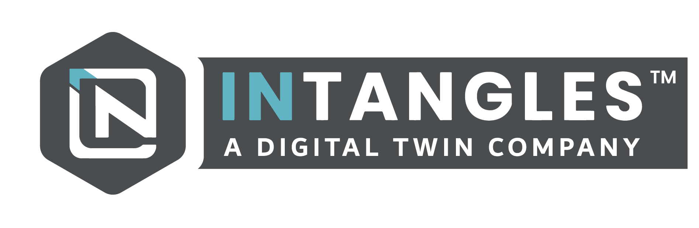

<!--
╔══════════════════════════════════════════════════════════════════════╗
║   KRISHNANUNNI J  ·  cyberpunk profile  ·  data // cars // gaming       ║
║   palette →  cyan #00F7FF · violet #7F5AF0 · pink #FF2E63 · lime #00FF9C ║
╚══════════════════════════════════════════════════════════════════════╝
-->

<!-- ============================ HEADER ============================ -->
<p align="center">
  
</p>

<p align="center">
  
</p>

<!-- socials -->
<p align="center">
  <a href="https://www.linkedin.com/in/krishnan-unni-j/"></a>
  <a href="mailto:kitchudj@gmail.com"></a>
  <a href="https://discord.gg/3xEaEZArbP"></a>
  <a href="https://mrpdev.mrprp.in/"></a>
  
</p>

<!-- live counters -->
<p align="center">
  
  &nbsp;&nbsp;&nbsp;
  
  &nbsp;&nbsp;&nbsp;
  
</p>


<!-- ============================ BOOT ============================ -->
## `> boot: initializing profile...`

<p align="center">
  
</p>

<table width="100%">
<tr><td>

`🔴 🟡 🟢`  &nbsp;&nbsp; **krishnanunni@intangles** — `python3 ~/me.py` &nbsp;&nbsp; `— zsh — 80×24`

```python
>>> from krishnanunni import Me
>>> me = Me()

>>> me.whoami()
'Data Analyst @ Intangles Lab · RNA / Analytics'

>>> me.alter_ego()
'Founder & Owner @ Mangalashery RP (FiveM roleplay city)'

>>> me.origin
'ex-automobile engineer → reverse-engineered into data'

>>> me.stack
['Python', 'R', 'SQL', 'MLOps', 'Lua']

>>> me.loves
['fleet_data', 'fast_cars', 'clean_code', 'leaderboards']

>>> me.solve(problem)          # brute force is for people who don't drift
... hypothesize() → model() → benchmark()
... complexity: O(n log n)     # never O(n²) on my watch
'shipped 🚀'

>>> me.debug(bug)
'fixed it. probably broke something else. fixing that too.'

>>> me.status
'ONLINE — caffeine levels nominal ☕'
```

</td></tr>
</table>

<div align="center">

`⚡ Optimizing cars, code, and entire GTA cities since forever ⚡`

</div>

<!-- ============================ QUICK STATS HUD ============================ -->
## `> player.hud`

<div align="center">

| ⚙️ CLASS | 🏢 FACTION | 🎖️ RANK | 🔋 XP SOURCE |
|:---:|:---:|:---:|:---:|
| Data Analyst | Intangles Lab · RNA | Analytics Team | Fleet & Sensor Data |
| 🎮 SIDE QUEST | 🚔 GUILD | 🌆 SERVER | ☕ FUEL |
| FiveM Dev | Mangalashery RP | mrprp.in | Coffee + Telemetry |

</div>

<details>
<summary><b>📊 Skill Bars — click to expand the loadout</b></summary>

<br/>

```text
Python        ███████████████████░  95%   [ADVANCED]
SQL           ████████████████░░░░  80%   [PROFICIENT]
R             ██████████████░░░░░░  70%   [PROFICIENT]
MLOps         █████████████░░░░░░░  65%   [GROWING]
Deep Learning ████████████░░░░░░░░  60%   [GROWING]
Lua / FiveM   ███████████████░░░░░  75%   [PROFICIENT]
Data Viz      █████████████████░░░  85%   [ADVANCED]
Automotive    ██████████████████░░  90%   [DOMAIN EXPERT]
```

</details>

<br/>

<!-- ============================ ABOUT DETAIL ============================ -->
## `> cat about_me.md`

<table align="center">
<tr>
<td>🔭</td><td><b>Currently building</b></td><td>AI-powered fleet mgmt · DTC metadata pipelines · predictive diagnostics at scale</td>
</tr>
<tr>
<td>🌱</td><td><b>Leveling up</b></td><td>deep learning for real-time fleet monitoring</td>
</tr>
<tr>
<td>🎮</td><td><b>Off the clock</b></td><td>running a full-blown FiveM roleplay city + racing sims</td>
</tr>
<tr>
<td>🚗</td><td><b>Origin story</b></td><td>fell into data through engines, not the other way around</td>
</tr>
<tr>
<td>⚡</td><td><b>Fun fact</b></td><td>helped build an award-winning EV before I ever touched a notebook</td>
</tr>
<tr>
<td>🤝</td><td><b>Open to</b></td><td>data / ML collabs, automotive analytics, FiveM scripting talk</td>
</tr>
</table>

<blockquote align="center">
I fell into data through engines, not the other way around. Now I diagnose a
vehicle's health through data instead of a stethoscope — and when the workday
ends, I go run an entire roleplay city. Same instinct either way: <b>optimize
the system.</b>
</blockquote>

<br/>

<!-- ============================ INTANGLES ============================ -->
## `> load faction: INTANGLES`

<table>
<tr>
<td width="30%" align="center">
  
  <br/><br/>
  
  
</td>
<td width="70%">

### 🛰️ Data Analyst — Intangles Lab Pvt. Ltd.
**RNA · Analytics Team · Pune, Maharashtra** &nbsp;`May 2024 – Present`

> *A Digital Twin company — AI-powered fleet management & predictive maintenance.*

- 🐍 Developed & automated **90%+** of RNA's Python scripts for large-scale data processing, reporting & predictive diagnostics
- 🧩 Owned the complete **DTC metadata pipeline** — enrichment, subsystem mapping & manufacturer-specific standardization for accurate fault interpretation
- 📊 Model fitting for **air intake diagnostics**; benchmarked algorithm accuracy across battery voltage, fuel level, coolant temp, fuel trim & fuel rail pressure
- 🤝 Shipped AI-driven solutions, firmware validation & real-time fleet monitoring with **Python, R, SQL & MLOps**

</td>
</tr>
</table>

<details>
<summary><b>🔍 Mission log — what a "digital twin for fleets" actually means</b></summary>

<br/>

```text
[MISSION] predictive maintenance
  └─ ingest telematics ── sensors, DTCs, firmware signals
  └─ enrich metadata  ── subsystem + manufacturer mapping
  └─ model health     ── air intake, fuel system, battery, coolant
  └─ benchmark accuracy across signal types
  └─ alert BEFORE the breakdown, not after
```

**What I own end-to-end**
- 🧩 **DTC metadata pipeline** — turning raw fault codes into human-readable, manufacturer-correct diagnostics
- 📊 **Diagnostic model fitting** — air intake + multi-signal benchmarking (battery voltage, fuel level, coolant temp, fuel trim, fuel rail pressure)
- 🐍 **Automation layer** — 90%+ of the team's Python scripts for processing, reporting & diagnostics
- 🔧 **Firmware validation** — validating the risky stuff before it ships to real vehicles
- 📡 **Real-time monitoring** — fleet health you can watch live

</details>

<br/>

<!-- ============================ MRP ============================ -->
## `> load side_quest: MANGALASHERY_RP`

<table>
<tr>
<td width="70%">

### 🚔 MRP — Mangalashery RP
**Founder & Owner · FiveM Roleplay City**

> A living, breathing GTA V roleplay community — cops, gangs, businesses, cinematic chases and a whole economy that never sleeps.

<p>
  <a href="https://mrpdev.mrprp.in/"></a>
  <a href="https://discord.gg/3xEaEZArbP"></a>
</p>

- 🌆 Building custom **FiveM / GTA V** scripts, jobs & economy systems
- 🕹️ Managing a live gaming community & server infrastructure
- 👮 Roleplay factions — cops, gangs, businesses & civilians
- 🎬 Because optimizing cars, code **and** entire cities is the dream

</td>
<td width="30%" align="center">
  
  <br/><br/>
  <a href="https://discord.com/users/530981225033105419"></a>
  <br/>
  
  
</td>
</tr>
</table>

<details>
<summary><b>🏙️ City systems — the tech under the roleplay</b></summary>

<br/>

```lua
-- mangalashery_rp :: server loadout
Server = {
    engine   = "FiveM / CFX",
    language = "Lua",
    world    = "GTA V (Los Santos, reimagined)",
    economy  = "jobs • businesses • cash flow • assets",
    factions = { "PD", "EMS", "gangs", "civilians", "mechanics" },
    vibe     = "cinematic chases + slow-burn roleplay",
    uptime   = "the city never sleeps"
}
```

**What running the city means**
- 🧱 Custom scripts & job systems (Lua)
- 💸 A working in-game economy players actually live in
- 🛠️ Server infra, updates & moderation
- 👥 A live community — onboarding, events, support
- 🌐 Dev portal → [mrpdev.mrprp.in](https://mrpdev.mrprp.in/)
- 💬 Discord → [join here](https://discord.gg/3xEaEZArbP)

</details>

<br/>

<!-- ============================ TECH ARSENAL ============================ -->
## `> inventory: tech_arsenal`

<p align="center">
  
</p>

<details open>
<summary><b>🧬 Full loadout by category</b></summary>

<br/>

**⌨️ Programming**
-3776AB?style=flat-square&logo=python&logoColor=white)


-2C2D72?style=flat-square&logo=lua&logoColor=white)

**🧠 Data Science & ML**


Predictive Modeling · Data Cleaning & Validation · Algorithm Accuracy Benchmarking · Big Data Handling · Supervised / Unsupervised Learning · Deep Learning · AI-based Maintenance · MLOps

**🚗 Automotive Domain**
DTC Diagnostics · Telematics · Firmware Validation · Fleet Systems · Vehicle Specs · Sensor Signal Analysis

**📊 Visualization**


**🧰 Tools**


-217346?style=flat-square&logo=microsoftexcel&logoColor=white)

</details>

<br/>

<!-- ============================ PROJECTS ============================ -->
## `> repo: featured_projects`

<table>
<tr>
<td width="50%" valign="top">

### 🏎️ SEVC 2022
`electric-vehicle` `award-winning`
> Award-winning cost-efficient electric vehicle build. Where I first learned that a machine is just a system waiting to be optimized.

</td>
<td width="50%" valign="top">

### 🛑 Auto Braking System
`safety` `embedded`
> Safety-first automatic braking design for four-wheelers — stopping power that reacts faster than a human can.

</td>
</tr>
<tr>
<td width="50%" valign="top">

### 😴 Drowsiness Detection
`computer-vision` `safety`
> Detects driver fatigue and halts the vehicle to prevent accidents. Data guarding lives, not just dashboards.

</td>
<td width="50%" valign="top">

### 🎬 Movie Recommendation System
`ml` `collaborative-filtering`
> A recommendation engine for personalized movie suggestions — my first taste of turning behavior into prediction.

</td>
</tr>
<tr>
<td width="50%" valign="top">

### 🛢️ AI-Assisted Oil Monitoring
`predictive-maintenance` `ai`
> Predicts engine oil health to trigger maintenance alerts before things go wrong.

</td>
<td width="50%" valign="top">

### 🚔 Mangalashery RP
`fivem` `lua` `community`
> A custom FiveM roleplay city — scripts, jobs, economy & a live community that logs in every night.

</td>
</tr>
</table>

<br/>

<!-- ============================ EXPERIENCE TIMELINE ============================ -->
## `> git log --graph : the timeline`

```text
* 2024 ──● Data Analyst @ Intangles Lab (RNA / Analytics)     [current save]
|         └─ 90%+ script automation · DTC pipeline · diagnostics
|
* 2024 ──● BE Automobile Engineering — SNS College (CGPA 9.2) [level up]
|         └─ SEVC 2022 · auto-braking · drowsiness detection
|
* 2021 ──● Diploma in Automobile Engineering (CGPA 9.1)       [foundations]
|
* 2018 ──● SSLC — PSG Sarvajana (CGPA 7.7)                    [tutorial]
|
* ~~~~ ──● Founded Mangalashery RP (FiveM)                    [side quest unlocked]
```

<br/>

<!-- ============================ EDUCATION ============================ -->
## `> academy: education`

| 🎓 Degree | 🏫 Institution | 📅 Years | 🏆 CGPA |
|---|---|:---:|:---:|
| BE Automobile Engineering | SNS College of Technology, Coimbatore | 2021 – 2024 | **9.2** |
| Diploma in Automobile Engineering | Suguna Polytechnic College, Coimbatore | 2018 – 2021 | **9.1** |
| SSLC | PSG Sarvajana Higher Secondary School, Coimbatore | 2017 – 2018 | **7.7** |

<br/>

<!-- ============================ ACHIEVEMENTS ============================ -->
## `> achievements.unlocked`

<div align="center">

| 🏅 | Achievement | Detail |
|:---:|---|---|
| 🏎️ | **EV Builder** | Helped build an award-winning cost-efficient EV |
| 🤖 | **Automation Ace** | Automated 90%+ of a team's Python workload |
| 🧩 | **Pipeline Architect** | Owns the full DTC metadata pipeline end-to-end |
| 🎯 | **9.2 CGPA** | Graduated BE Automobile Engineering near-top |
| 🚔 | **City Founder** | Built & runs a live FiveM roleplay server |
| 🎮 | **Leaderboard Regular** | If it has a scoreboard, I'm on it |

</div>

<br/>

<!-- ============================ GITHUB STATS ============================ -->
## `> telemetry: github_stats`

<p align="center">
  
  
</p>

<p align="center">
  
</p>

<p align="center">
  
</p>

<!-- 🏎️ animated snake racing across the contribution grid (generated by GitHub Action) -->
<p align="center">
  
</p>

<p align="center"><sub>🏁 the track fills as I commit — a lap through every contribution</sub></p>

<br/>

<!-- ============================ NOW PLAYING ============================ -->
## `> now_playing`

<table align="center">
<tr>
<td align="center">🏎️<br/><b>Racing Sims</b></td>
<td align="center">🎯<br/><b>Strategy Games</b></td>
<td align="center">🚔<br/><b>FiveM Roleplay</b></td>
<td align="center">📊<br/><b>Dataset Diving</b></td>
</tr>
</table>

<blockquote align="center">
Racing sims, strategy games, and the occasional rage-quit — if it's got a
leaderboard, I'm probably on it. When I'm not debugging telemetry at work,
I'm running an entire roleplay city at night. Somewhere in between I accepted
I just like <b>optimizing things</b> — cars, code, K/D ratios, or a whole GTA economy.
</blockquote>

<br/>

<!-- ============================ CONNECT / CTA ============================ -->
## `> connect --with-me`

<p align="center">
  <a href="https://www.linkedin.com/in/krishnan-unni-j/"></a>
  <a href="mailto:kitchudj@gmail.com"></a>
</p>

<p align="center">
  <a href="https://discord.gg/3xEaEZArbP"></a>
  <a href="https://mrpdev.mrprp.in/"></a>
</p>

<!-- ============================ FOOTER ============================ -->


<p align="center"><i>⭐ From engines to endpoints — cars, code, or entire cities: always tuning something.</i></p>
